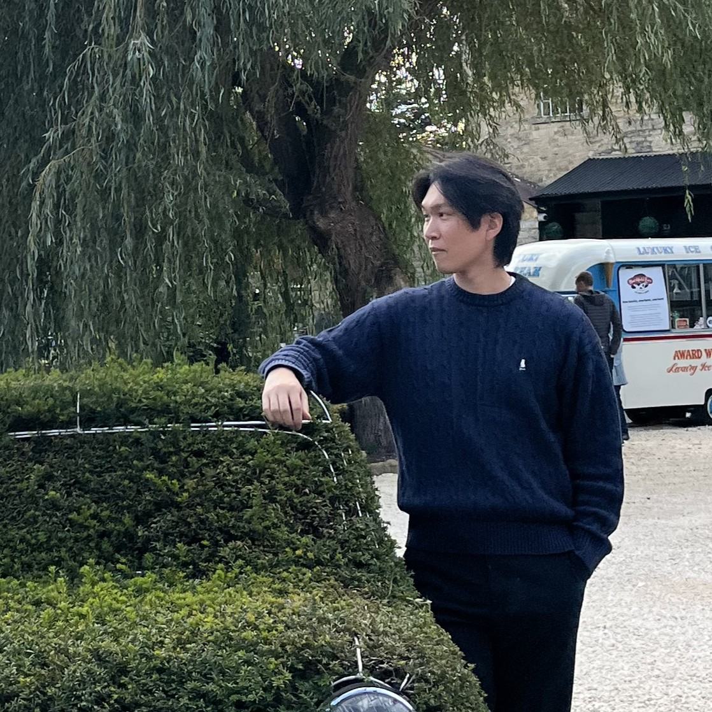

## About Me

PhD student in School of Cybersecurity, Korea University

### Research Interest

- Cybersecurity 🛡️
- Digital Forensics 🎓
- Software Development 🛠️

### Links

- [Blog](https://geun-yeong.tistory.com)
- [Github](https://github.com/geun-yeong)
- [Scholar](https://scholar.google.com/citations?user=0RYB4wYAAAAJ&hl=ko)
- [LinkedIn](https://linkedin.com/in/geunyeong)
- [Laboratory](https://dfrc.korea.ac.kr)

---

## Experience

2025.09 - 2026.02 | Visiting Student at Kellogg College, University of Oxford
2022.03 - Present | Full-time Researcher at Digital Forensics Lab, Korea University
2021.07 - 2021.12 | Intership Developer at WINS Co., Ltd.
2020.07 - 2021.03 | Digital Forensics Student at Best of the Best Program, KITRI

---

## Publications

### International
1. J. Lee, **G. Choi**, J. Han, and J. Park, "Advanced Monero Wallet Forensics: Demystifying Off-Chain Artifacts to Trace Privacy-Preserving Cryptocurrency Transactions", DFRWS APAC, 2025 [🔗](https://doi.org/10.1016/j.fsidi.2025.301988)
1. **G. Choi**, J. Bang, S. Lee, and J. Park, "*Chracer*: Memory analysis of Chromium-based browsers", DFRWS APAC, 2023 [🔗](https://doi.org/10.1016/j.fsidi.2023.301613)
1. S. Cheon, **G. Choi**, and D. Kim, "A Cheating Attack on a Whitelist-based Anti-Ransomware Solution and its Countermeasure", IEEE ICCE, 2023 [🔗](https://doi.org/10.1109/ICCE56470.2023.10043480)
1. D. Kim, **G. Choi**, and J. Lee, "White List-based Ransomware Real-time Detection and Prevention for User Device Protection", IEEE ICCE, 2018 [🔗](https://doi.org/10.1109/ICCE.2018.8326119)

### Domestic

1. H. Park, **G. Choi**, and J. Park, "A Study on Automating Forensic Artifact Identification and Change Tracking for Electron-based Applications", Journal of Digital Forensics, 2025
1. Y. Jeon, **G. Choi**, and J. Park, "A Study on Forensic Analysis Methods for STT (Speech-To-Text) Applications in Android Environments", Journal of The Korea Institute of Information Security and Cryptology, 2025
1. Y. Lee, **G. Choi**, and J. Park, "A Study on Methods for Identifying Traces of Web-Based Cryptocurrency Exchange Services", Journal of Digital Forensics, 2025
1. S. Yun, **G. Choi**, and J. Park, "A Study on User Behavior Analysis Techniques Leveraging macOS's Apple Unified Log", Journal of Digital Forensics, 2024
1. H. Gwon, B. Jeong, **G. Choi**, and J. Park, "Research on Method for Analyzing and Normalizing Android Diagnostic Logs for Digital Forensics", Journal of Digital Forensics, 2023
1. J. Choi, **G. Choi**, and S. Lee, "Tracing Copyright Infringement Activities through Illegal Streaming Device Protocol Analysis", Journal of Digital Forensics, 2023
1. S. Jeong, **G. Choi**, J. Jeon, E. Jo, Y. Hwang, H. Nam, K. Kim, and J. Kim, "Collection and Analysis Methods of Automatic Identification System Artifacts", Journal of Digital Forensics, 2021

--- 

## Presentation

- "Investigation of copyright infringment site usage traces through memory forensics", KSIE Conference on Fall, 2023
- "*Chracer*: Memory analysis of Chromium-based browsers", DFRWS APAC, 2023
- "A study on collecting and normalizing potential digital evidence from Android devices using ADB commands", KDFS Conference on Summer, 2023
- "A Cheating Attack on a Whitelist-based Anti-Ransomware Solution and its Countermeasure", IEEE ICCE, 2023
- "File Access Monitoring using File System Filter Driver", U.U.U Workshop, 2017

---

## Prize and Honor

- Best Poster, DFRWS APAC, 2025  
  Paper: "LLM-Assisted Detection of Suspicious Conversations Using NER and RAG-Based Candidate Message Retrieval" 
- Best Paper (issued by Commissioner General of Korea Coast Guard), KDFS Winter Conference, 2025  
  Paper: "LLM-Assisted Detection of Suspicious Conversations Using NER and RAG-Based Candidate Message Retrieval"
- Winner (1st place), DFRWS ICS Challenge, 2025
- Best Paper (issued by President of KDFS), KDFS Summer Conference, 2025  
  Paper: "A Study on Automating Forensic Artifact Identification and Change Tracking for Electron-based Applications"
- Best Paper (issued by Commissioner General of Korean National Police Agency), KDFS Winter Conference, 2024  
  Paper: "A Study on Methods for Identifying Traces of Web-Based Cryptocurrency Exchange Services"
- Best Paper (issued by Commissioner General of Korean National Police Agency), KDFS Summer Conference, 2023  
  Paper: "A study on collecting and normalizing potential digital evidence from Android devices using ADB commands"
- Excellence Prize (2nd place), Cyber Security AI·BigData Challenge, 2022
- Top Prize (1st place), Cyber Security AI·BigData Challenge, 2021
- BEST 10, KITRI Best of the Best (BoB) Program, 2021
- Best Paper (issued by President of KDFS), KDFS Winter Conference, 2020  
  Paper: "Forensic analysis of Chinese automatic identification system"
- Participation Prize, KDFS Digital Forensics Challenge, 2020
- Bronze Medal (3rd place), The 49th National Skills Competition, 2014
- Bronze Prize (3rd place), NetRiders Korea 2014 - The 10th Skill Competition, 2014
- Excellence Prize, The 48th National Skills Competition, 2013

---

## Education

- PhD, Korea University (2024 - Present)
- MS, Korea University (2022 - 2024)
- BE, University of Suwon (2016 - 2022)